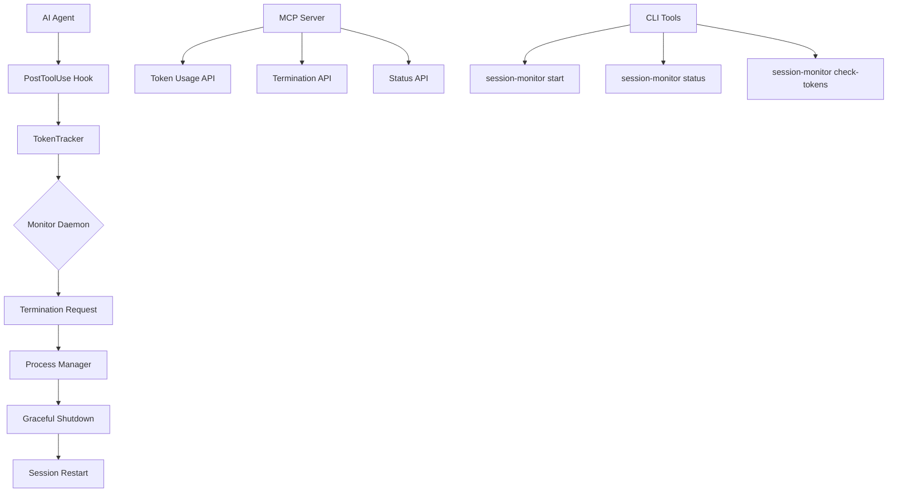

# Session Monitor

The Session Monitor provides automatic token usage tracking and graceful session termination for Claude Code sessions to prevent context loss due to token limits.

## Overview

The session monitor system consists of several components working together:

- **Token Tracker**: Estimates token usage from session logs and transcripts
- **Monitor Daemon**: Background service that processes termination requests
- **MCP Server**: Programmatic interface for token monitoring
- **CLI Tools**: Command-line interface for managing the monitor
- **Hook Integration**: Automatic token tracking during tool execution

## Architecture



## Installation

The session monitor is integrated into the amplifier codebase. No separate installation is required.

## Usage

### Starting the Monitor

Start the session monitor daemon:

```bash
make session-monitor-start
```

Or directly:

```bash
uv run session-monitor start
```

### Checking Token Usage

Check current token usage for your workspace:

```bash
make session-monitor-check-tokens
```

Or:

```bash
uv run session-monitor check-tokens
```

### Requesting Termination

From within an agent workflow, request termination:

```bash
uv run session-monitor request-termination \
  --reason token_limit_approaching \
  --continuation-command "claude --continue-session" \
  --priority graceful
```

### Checking Status

View monitor status and active sessions:

```bash
make session-monitor-status
```

### Stopping the Monitor

Stop the daemon:

```bash
make session-monitor-stop
```

## Configuration

Configuration is stored in `.codex/config.toml`:

```toml
[session_monitor]
enabled = true
check_interval_seconds = 5
token_warning_threshold = 80
token_critical_threshold = 90
max_restart_attempts = 3
restart_backoff_seconds = 2
workspace_base_dir = ".codex/workspaces"
```

## Integration with Workflows

### Agent Prompt Integration

Add token checking to your agent prompts:

```bash
# Check token usage before starting complex tasks
TOKEN_STATUS=$(uv run session-monitor check-tokens 2>/dev/null; echo $?)
if [ $TOKEN_STATUS -ge 2 ]; then
    echo "⚠️  Token usage critical, requesting termination"
    uv run session-monitor request-termination \
      --reason token_limit_approaching \
      --continuation-command "$0 $*" \
      --priority graceful
    exit 0
fi
```

### Bash Script Integration

Use the helper script in automation:

```bash
#!/bin/bash
# Check token budget and exit if critical
.codex/tools/session_monitor_helper.py check-tokens
if [ $? -ge 2 ]; then
    .codex/tools/session_monitor_helper.py request-termination \
        --reason token_limit_approaching \
        --continuation-command "$0"
    exit 0
fi
```

### Hook-Based Monitoring

The system automatically tracks token usage through the post-tool-use hook. When token usage exceeds thresholds:

- **80%**: Warning logged to stderr
- **90%**: Termination request created automatically

## File Locations

The session monitor creates several files in the `.codex/` directory:

```
.codex/
├── session_monitor.pid          # Daemon process ID
├── config.toml                  # Configuration file
├── workspaces/
│   └── {workspace}/
│       ├── termination-request  # JSON file for IPC
│       ├── session.pid          # Current session process ID
│       ├── checkpoint.json      # Session checkpoint data
│       ├── token_history.jsonl  # Token usage log
│       └── token_warning.txt    # Warning messages
└── logs/
    └── token_monitor_*.log      # Monitor logs
```

## Checkpoint and Resume

The session monitor integrates with the session management system to provide checkpoint/resume functionality:

### Creating Checkpoints

Sessions can save their state before termination:

```python
from amplifier.ccsdk_toolkit.sessions.manager import SessionManager

manager = SessionManager()
checkpoint_data = {
    "current_task": "implementing authentication",
    "completed_steps": ["setup", "database"],
    "next_step": "api endpoints"
}
manager.save_checkpoint(session_id, checkpoint_data)
```

### Resuming Sessions

Restarted sessions can restore their previous state:

```python
# Load checkpoint and resume
checkpoint = manager.load_checkpoint(session_id)
if checkpoint:
    # Restore session state
    session_state = manager.resume_session(session_id, continuation_command)
```

## MCP API

The token monitor provides an MCP server interface for programmatic access:

### Get Token Usage

```python
# Via MCP tool call
result = await get_token_usage("workspace_id")
# Returns: {"estimated_tokens": 75000, "usage_pct": 75.0, "source": "transcript"}
```

### Check Termination

```python
result = await check_should_terminate("workspace_id")
# Returns: {"should_terminate": false, "reason": "within safe limits"}
```

### Request Termination

```python
result = await request_termination(
    "workspace_id",
    "token_limit_approaching",
    "claude --continue",
    "graceful"
)
```

## Troubleshooting

### Daemon Won't Start

Check if another instance is running:

```bash
make session-monitor-status
```

Kill existing daemon if needed:

```bash
pkill -f session_monitor
make session-monitor-start
```

### Token Estimates Incorrect

Token estimates are conservative (1.3x word count). For more accurate tracking:

1. Use Claude Code transcripts when available (preferred)
2. Ensure session logs are accessible
3. Check the source field in token usage output

### Termination Not Working

Verify the target process exists:

```bash
ps aux | grep <pid>
```

Check daemon logs:

```bash
tail -f .codex/logs/token_monitor_$(date +%Y%m%d).log
```

### High CPU Usage

The daemon checks for requests every 5 seconds by default. Increase the interval in config:

```toml
[session_monitor]
check_interval_seconds = 10
```

## API Reference

### CLI Commands

- `session-monitor start`: Start the monitor daemon
- `session-monitor stop`: Stop the monitor daemon
- `session-monitor status`: Show daemon and session status
- `session-monitor check-tokens`: Check token usage for workspace
- `session-monitor list-sessions`: List all monitored sessions
- `session-monitor request-termination`: Create termination request

### MCP Tools

- `get_token_usage(workspace_id)`: Get current token usage
- `check_should_terminate(workspace_id)`: Check if termination needed
- `request_termination(...)`: Create termination request
- `get_monitor_status()`: Get daemon status
- `health_check()`: Verify server health

### Python API

```python
from amplifier.session_monitor import TokenTracker, SessionMonitorDaemon
from amplifier.session_monitor.models import MonitorConfig

# Track token usage
tracker = TokenTracker()
usage = tracker.get_current_usage("workspace_id")

# Start daemon
config = MonitorConfig()
daemon = SessionMonitorDaemon(config)
await daemon.start()
```